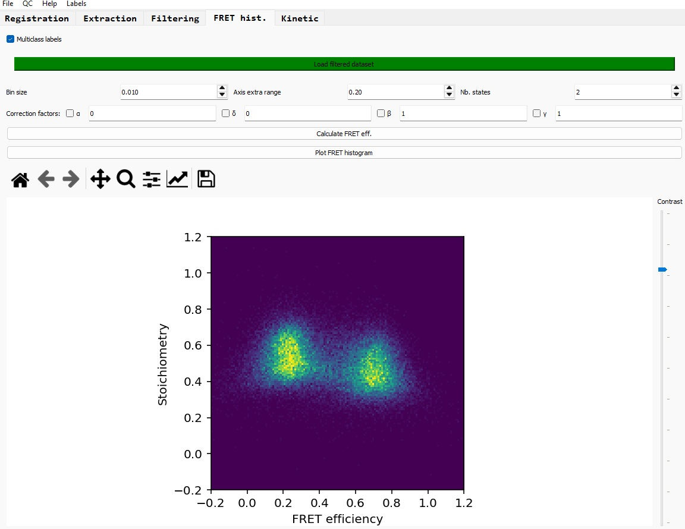
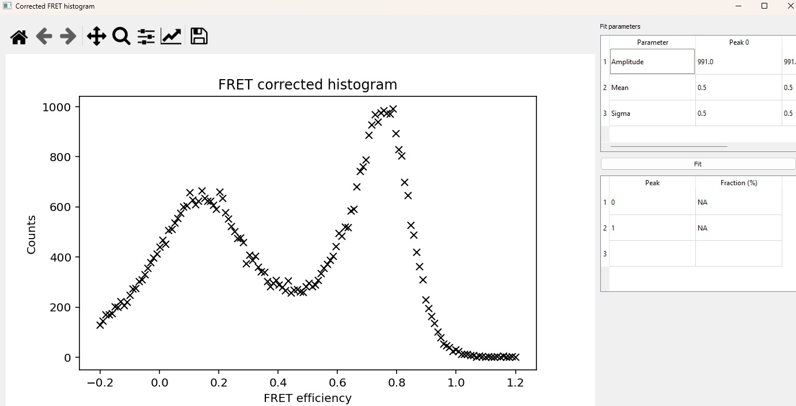

# FRET histogram

After the filtering of your dataset and selection of the FRET, Donor-Only and Acceptor-Only relevant sections of the traces, you can process to the corrected FRET histogram.

*NB: You need ALEX-smFRET data to conduct this step, as the acceptor-acceptor channel is required to estimate the delta, beta and gamma correction factors.*

## Load the filtered dataset

Click on the button 'Load filtered dataset' to select the previously filtered dataset; this dataset should contain 'FRET', DO' and 'AO' labels.

Once the dataset has been successfully loaded, the loading button appears in green.

## Display the SE FRET histogram

To display the Stoichiometry-Efficiency (SE) FRET histogram, click on 'Calculate FRET eff.' button. This process takes as inputs the 'FRET' labelled traces and the FRET corrections factors values to compute the SE histogram.

You can change the bin size, the extra range for both axis (i.e. out of the range [0-1]), and the number of expected discrete states (by default 2; this parameter is used to fit the beta and gamma FRET correction factors).

## FRET correction factors calculation

To calculate the FRET correction factors, simply click on the associated boxes, and the calculation will be automatically performed. The resulting values are then displayed next to the boxes. 
Alternatively, you can set yourself the values for these correction factors.

To process the FRET corrected SE histogram, follow the folowing pipeline:

  1. After loading the dataset, run 'Calculate FRET eff.'
  2. Click on the alpha box; its value is computed and you can visually check the corect fit of the Donor-Only peak
  3. Click on the delta box; its value is computed and you can visually check the corect fit of the Acceptor-Only peak
  4. Run 'Calculate FRET eff.', so the histogram is corrected for the alpha and delta factors.
  5. Click on either the beta or gamma boxes (both are doing the running the same process)
  6. Finally run 'Calculate FRET eff.'
  
The FRET corrected SE histogram is displayed.

## Plot the corrected FRET efficiency histogram

Click on 'Plot FRET histogram' to display the corrected FRET efficiency histogram; a new window shows up.

### Fit the peaks

You can set initial values to fit the FRET peaks, including the Gaussian amplitude, mean (FRET efficiency) and standard deviation, for each individual peak. You can set the number of FRET states in the previous window.
Click on 'Fit' to run the fitting process.

Once you are satisfied with the fits, you can read the fit parameters in the top right table and the FRET populations in the bottom right table.