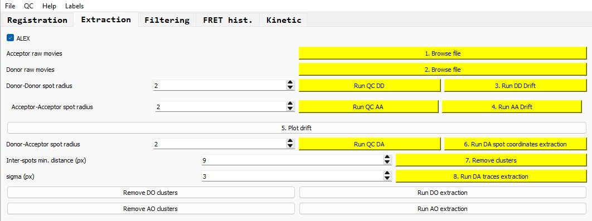
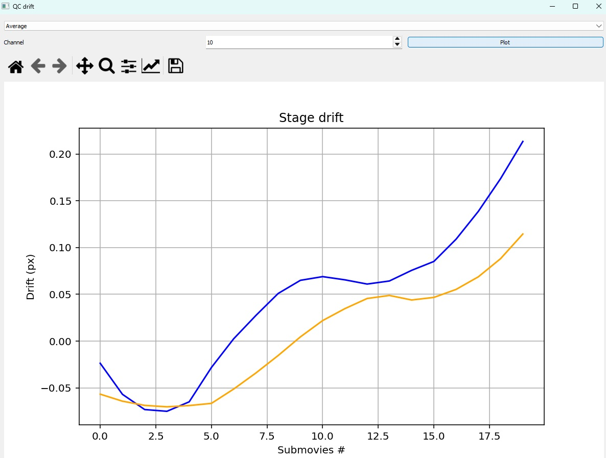

# Traces extraction

Once the [registration](registration.md) step has been completed, you can process to the traces extraction section.

For the extraction of traces, the drift of the microscope stage over time is first calculated from both the donor-donor and acceptor-acceptor (if ALEX-smFRET) channels, and then averaged. For each channels, the spots are
detected using a LoG filter and tracked over time, and the center of mass of all these spots is calculated and taken as the stage drift. If the data are not ALEX, then only the donor-donor channel is used for the drift correction.

For the traces extraction, the spots are first detected on the donor-acceptor channel using the same tracking algorithm as the one for the drift correction (LoG filter + tracking), the incentive is that a spot appearing during the movie (but not at the start) can be 
detected and "back-tracked" even before it appears. This feature is especially important for DyeCycling data.

Once the spots coordinates have been calculated, the extraction of the raw traces can be run, as well as the extraction of the median background values over time in each neighboring area of each spot.

The results (raw traces with associated backgrounds) can be saved as a JSON file following the [OpenFRET format](https://pypi.org/project/openfret/){:target="_blank"}

### If ALEX data

If your smFRET data have been acquired using the ALEX scheme, tick the 'ALEX' box.

## Loading the raw movies

Click on the 'Browse file' buttons to load both the acceptor and donor movies. The format for these data is expected to be TIFF, with the full movie split into submovies. 
In case of ALEX data, the acceptor submovies are expected to start with the acceptor-acceptor channel and frames alternating between acceptor-acceptor and donor-acceptor frames.

The number of donor submovies should match the one of acceptor submovies; in this case, the buttons appear in green after loading the data. Otherwise, the buttons are red and you have to check the files you have selected.

## Microscope drift calculation

Select the approximate radius (in pixels) you expect for the spots (usually around 2 px); this value is used for the LoG filter to detect the spot.

*NB: Please not that this radius does not need to be accurate; this is just used for the LoG detector to get an estimate of the size of objects it should look for.*

Click on 'Run QC DD' to detect the spots on the first donor-donor submovie and visually check that the detection is OK; if it is not, change the radius parameter and run the process again.

If the detection is satisfactory, you can click on 'Run DD Drift' to run the spot detection over all donor-donor submovies and calculate the stage drift from these submovies. The button then appears in green when the process is completed.

### If ALEX data

For ALEX data, you can run the exact same procedure but for the acceptor-acceptor submovies, so the drift cam also be calculated independently from this channel amd then averaged with the one calculated from the donor-donor submovies, but higher accuracy.

*NB: for the drift correction, you only need one estimate (either from donor-donor or acceptor-acceptor submovies); but having both is probably better.*

*NB: if you are confident of the radius parameters, you do not need to run the 'Run QC DD' or 'Run QC AA' buttons, as their purpose is to qualitatively check the radius parameter.*

### Visualization of the microscope drift

After the drift(s) calculation, click on the 'Plot drift' button, select the drift you want to visualize (DD: donor-donor, AA: acceptor-acceptor, Average: average between DD and AA, None: no drift), and click on the 'Plot' button.
The drift you plot is the one that will be taken for the downstream traces extraction.

You can visually check the the calculated drift makes sense compared to the timescale of you experiments: usually less than one pixel for a few minutes of acquisition, but it can be several pixels for experiments > 30 minutes 
(especially for DyeCycling).

## Spots detection on the Donor-Acceptor channel

After the drift calculation, select the expected radius for the spots in the donor-acceptor channel and run 'Run QC DA' to check the detection results. If this is OK, run 'Run DA spot coordinates extraction'.

## Filtering clusters of spots

Before the extraction of the raw traces, we filter the clusters of spots, i.e. spots that are closer than a given distance (in pixels). You can set this minimal distance, usually 9 pixels is fine, but it can be shorter if needed, especially
for waveguides experiments, in which the distance between adjacent nanowells can be shorter than 9 pixels.

*NB: This 9 pixels value comes from the fact that the extraction of the spot intensity is done within a radius of sigma pixels (usually 3 pixels, can be changed) around the spot center, and the background estimation within a ring of 
2 sigma. So 3 sigma sounds like the minimal distance between adjacent spots to avoid bias in the background estimation.*

*NB: Currently, the number of removed spots is just displayed in the console of the Python interpreter; I will implement a text box inside the GUI to display this information in a later version of PySMACKS.*

## Extraction of the raw traces and associated background

Set the radius of the disk used for the extraction of the spots intensity over time; this disk should encompass the entire spot shape so it is slightly larger than the spot itself. All pixels inside this disk will be summed and this value
is considered as the raw trace intensity value. This process is done for each spots, each frames and each channels.

For the background estimation, a ring of radius 2 sigma and thickness one sigma is applied to each spot; the median of the pixels located in this ring is calculated and multiplied by the surface (in pixels) of the disk used for the traces extraction,
and this value is considered as the raw background value. This process is done for each spots, each frames and each channels.

## Save extracted traces dataset

The results (traces + associated backgrounds) are stored into an [OpenFRET](https://pypi.org/project/openfret/){:target="_blank"} object and can be saved as a JSON file (compressed as JSON.zip) when ticking 
the box 'Extraction' in the 'Save as..' button in the 'File' tab.

