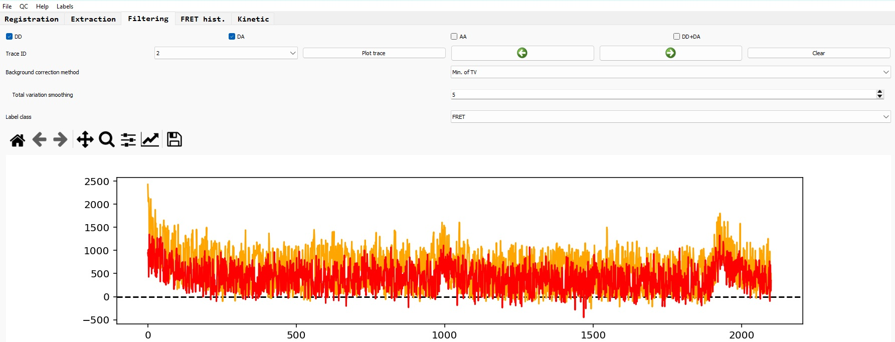
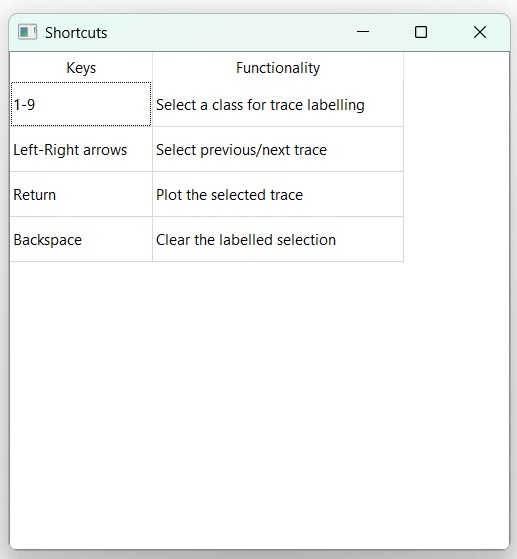
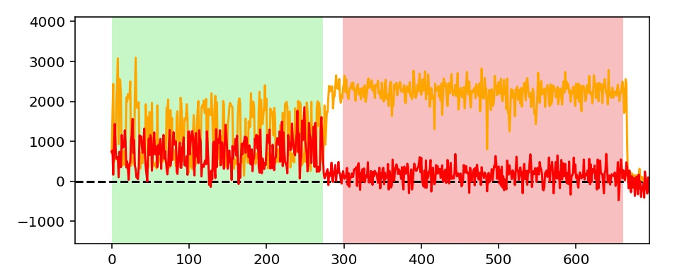
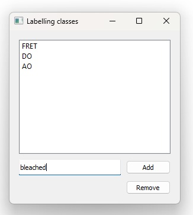

# Filtering

After the [extraction](extraction.md) of the raw traces and associated backgrounds, this section explains how to manually filter these traces to select the ones displaying target features, especially FRET signal.

*NB: Currently, this step needs to be performed by hand, which is time consuming. A deep learning approach is in development to automatize the process.*

## Loading the traces dataset

Go to the 'File' tab and select 'Load traces dataset'; select your json.zip dataset.

If the dataset is correctly loaded, the first trace should be displayed.

## Navigating through the dataset

The trace viewer is meant to be as intuitive as possible, with buttons to display/hide the different channels.

You can navigate through consecutive traces by clicking on the right/left arrows button of the interface, or using the left/right arrows of your keyboard, or by selecting the trace ID you want to view and click on 'Plot trace'.

This panel contains several keyboard shortcuts, and you can find a exhaustive list of these shortcuts by going to the 'Help' tab and click on 'Shortcuts'.

The figure which displays the traces contains a toolbar (from the matplotlib module), that you can use to interact with the plot (zoom, translation, scaling, display parameters, etc.). 
One useful tool among these is the translation tool (crossed-arrows): after selecting it, you can translate the plot with a mouse left click in both axis; the right click can scale one axis or the other, which is especially useful to zoom
and scale a specific part of the curve.

## Background correction

The first correction to apply before running the downstream analysis is the correction of the background. This can be done following different strategies:

  * None: no correction applied; this option can be useful for data that have already been corrected
  * Median: the median of the surrounding pixels around the spots is taken as the background value and removed from the raw traces; this corresponds to the values stored for the backgrounds during the extraction process.
  * Total variation: a total variation algorithm is applied to each background traces to smooth it and reduce the intrinsic noise from the background. You can set the smoothing parameter (the more, the smoother)
  * Minimum of Total variation (Min. of TV): same as the total variation method, except that the minimum of this TV processed background is taken as the final background level and removed from the raw traces (then the background is considered 
  constant). This is the recommended method, as it reduces the noise coming from the background and is likely to correspond to the trace intensity after photobleaching.
  
Once you have selected the background correction method, run 'Plot trace' to update the figure with the background corrected traces. This correction method will then be automatically applied to any displayed traces 
(when you navigate between different traces).

*NB: a background correction QC tool in under development, to help users assessing which method should be used.*

## Labelling traces

For the downstream analysis (SE histogram/ kinetics), you need to manually select the sections of each traces that should be included in the analysis: for instance, the sections that show a true FRET signal, 
or the donor-only and acceptor-only sections for the FRET correction factors estimation.

To do this, you can select the class of data you want to label ('FRET', 'DO', 'AO', etc.) and simply drag and drop the section with a mouse left click on the plot. If you then run 'Plot trace', the section you have selected will be displayed 
in a specific color. This color is different for each label classes.

As soon as you have selected a section, the coordinates of the boundaries of this section are stored in the dataset alongside the traces, and these coordinates will be used during the downstream analysis. 
In details, the coordinates are stored as a metadata entry at the trace level of the OpenFRET dataset, such as:

  * `dataset.traces[trace_ID].metadata['FRET']['indmin']` for the index of the first frame of the labelled section
  * `dataset.traces[trace_ID].metadata['FRET']['indmax']` for the index of the last frame of the labelled section
  
You can only select one section per class per trace, but you can have multiple classes per traces.

*NB: the labelling tool does not work when a matplotlib visualization tool from the toolbar is selected; make sure to unselect it before using the labelling tool.*

If you select a new region, the previously selected region for this class (if any) will be replaced by the new one.

In case you want to remove the selections, you can click on the 'Clear' button, which removes all selected regions for this specific trace; you can then re-select regions if you want.

*NB: you can use the keyboard shortcuts 1-9 on the numeric pad to select the 1st, 2nd... classes*

### Defining new label classes

Three different labe classes are defined by default: FRET, DO (donor-only), AO (acceptor-only). These three are the ones used for the downstream analysis.

However, for other applications, especially ML/DL training dataset curation, you might want to define your own classes. You can do it by selecting 'Edit' in the 'Labels' tab. Simply type the name of your class and press 'Add'; it automatically
add this new class and you can select it in the trace viewer.

You can also remove a class by selecting it and pressing 'Remove'.

## Save the filtering results

Before moving to the downstream analysis, you need to save the results: basically, it corresponds to the same traces dataset with extra metadata for the labelled traces. You can do it by selecting 'Save as' in the 'File' tab, 
and tick 'Extraction' in the 'Save results' window.