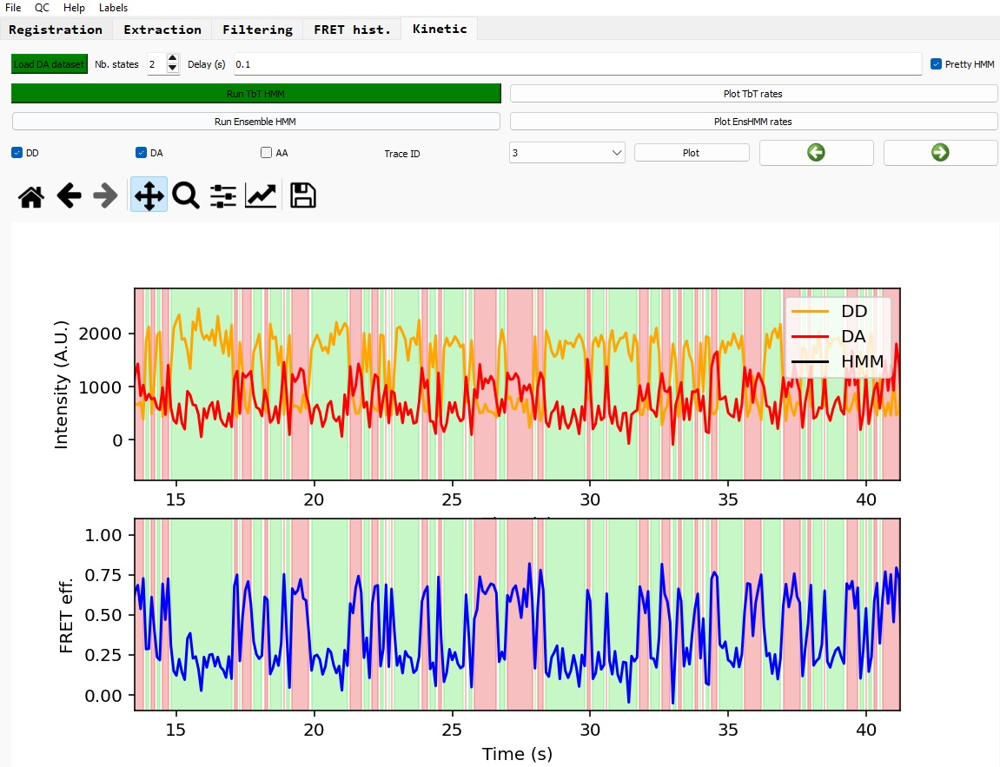
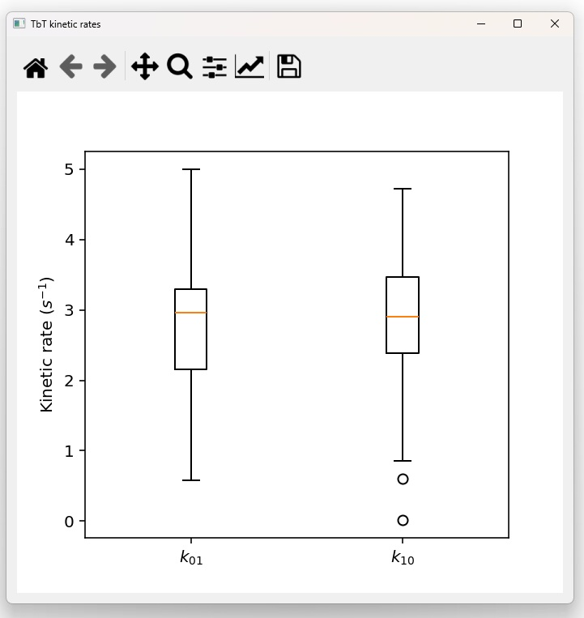
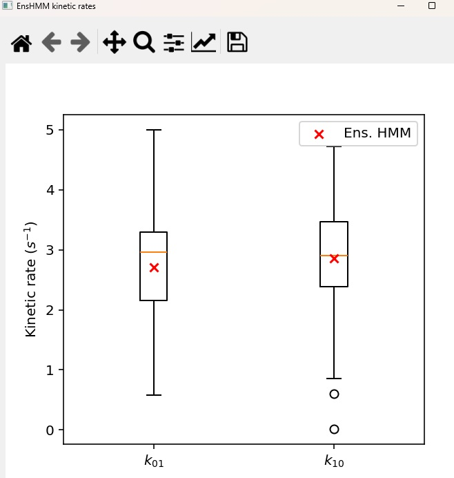

# Kinetics analysis

The last part of the analysis pipeline is the kinetics inference through Hidden Markov Model (HMM). The HMM method used here corresponds to a Python porting of the SMACKS framework (Igor based), which includes a Trace-by-Trace (TbT) HMM inference
but also an Ensemble HMM algorithm.

## Loading the dataset

First click on 'Load DA dataset' and select your 'FRET' labelled dataset (the one you hava saved after the filtering step). This dataset should contain traces with 'FRET' labels.

## Run the TbT HMM analysis

Select the number of states you expect for this dataset (by default 2), and the delay (in seconds) between each consecutive frames.

*NB: the delay is used to convert the extracted kinetic rates to physical unit, and for the plot display.*

Click on 'Run TbT HMM' button to run the Trace-by-Trace HMM analysis. Once the process is completed, the button appears in green and the first trace is displayed with colored section corresponding to different inferred states .

You can switch the display of the inferred states by ticking/unticking the 'Pretty HMM' button.

### Navigate between traces

In a similar way as the viewer for the traces filtering, you can navigate between traces to view the results of the TbT HMM inference.

*NB: Please note that the keyboard shortcuts do not work here. This will be fix in a later version.*

### View the rates distribution

Click on the 'Plot TbT rates' button to display a new window with boxplots for each of the state transitions. Additionally, another window is displayed showing a table with the mean rates matrix over all traces.

## Run the Ensemble HMM analysis

Click on the 'Run Ensemble HMM' button.

*NB: the button should appear in green at the end of the process, will be implemented in the next version of PySMACKS.*

After the calculations are completed, click on the button 'Plot EnsHMM rates' to display the same boxplot window as the TbT one, with additional data points for the Ensemble HMM results. It also displays the Ensemble HMM rate matrix.

## Saving the results

The HMM results are saved as metadata in the OpenFRET dataset, at the individual trace level.

You can save the analyzed dataset by selecting 'Save as' in the 'File' tab, and tick 'Extraction' in the 'Save results' window.

[END OF THE ANALYSIS PIPELINE]