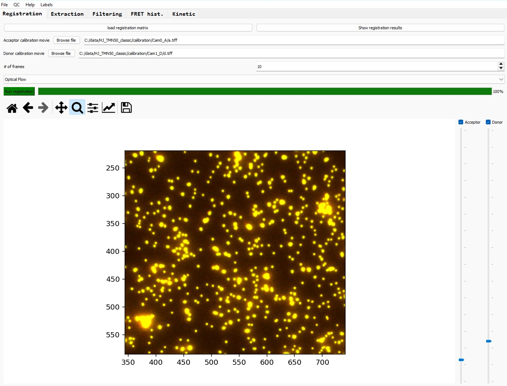
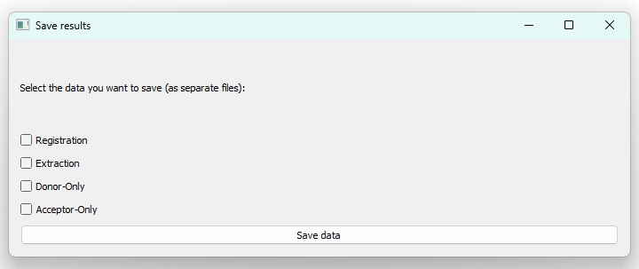
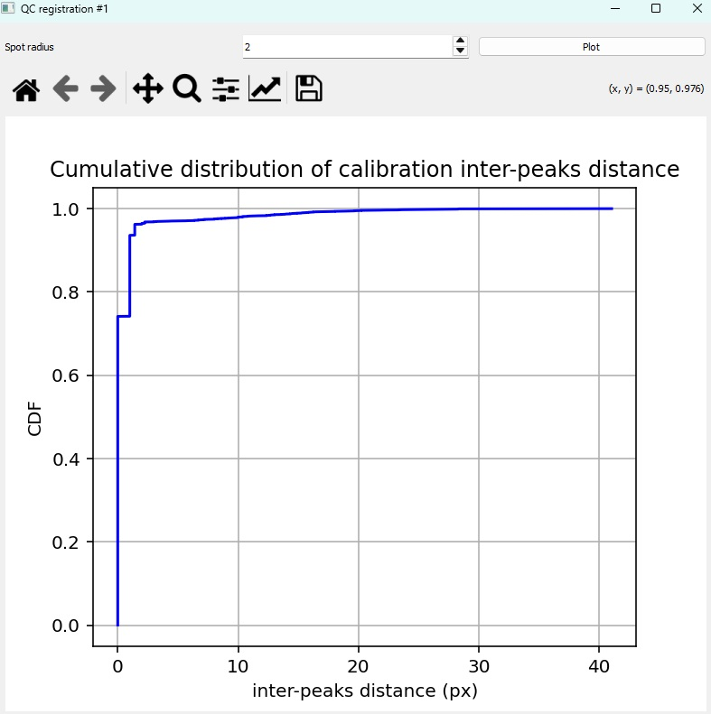

# Image Registration

The first step of the pipeline involves channels registration: indeed, due to chromatic aberration and cameras slight misalignment, the two channels might display a small but significant non-linear shift between objects 
that should normally co-localize.

To correct for these optical effects, we use optical beads emitting in both channels, acquire a short movie and use one of the two channels (acceptor channel) as reference for the registration process.

## Loading calibration beads movie

Select the acceptor and donor calibrations movies by clicking on 'Browse file' buttons; alternatively, you can directly paste the absolute paths for each files in the respective text boxes.

## Set the registration method and parameters

First select the number of frames that will be used as references for the registration calculations (usually 10 is OK)

Then select the registration method that you want to use; currently two available methods:

* Optical flow [[more info]](https://scikit-image.org/docs/stable/auto_examples/registration/plot_opticalflow.html){:target="_blank"}
* Affine transformation [[more info]](https://en.wikipedia.org/wiki/Affine_transformation){:target="_blank"}

Optical flow is the suggested method, as it seems to provide more accurate results.

## Run the registration

Finally click on 'Run registration' to start the process.

At the end of the calculation, the result of the registration is displayed using the first frames of each channels, superimposed in green and red, with the donor one shifted according to the registration results. If the registration is successful,
you should only observe a yellow color for every pixels; otherwise, if a significant part of the image is not correctly registered, you can run the process again with increased number of reference frames.

If you are satisfied with the registration, you can save the results by clicking on 'Save as...' in the 'File' tab, and tick 'Registration' in the opening window.

You can go to the next step of the pipeline: [traces extraction](extraction.md)

## Quality check for the registration

In addition, you can click on the 'QC' tab --> 'Registration QC', to open a new window and plot the calculated remaining distance between colocalizing spots in both channel. 
This is the Euclidian distance with spot coordinates as integers (no Gaussian fitting of individual spots, hence the step-wise shape of the curve.

The spot radius used for the spot detection can be tuned (usually 2 pixels).

The cumulative distribution function of the remaining distances is plotted. For a successful registration, most of the distances should be 0 or 1.

